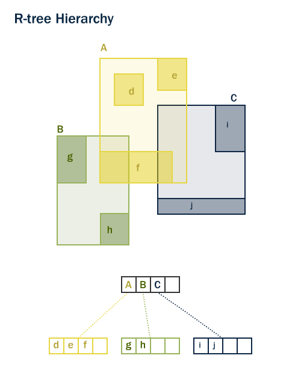

Spatial Indexing {#indexing}
================

Recall that spatial index is one of the three key features of a spatial
database. Indexes are what make using a spatial database for large data
sets possible. Without indexing, any search for a feature would require
a "sequential scan" of every record in the database. Indexing speeds
up searching by organizing the data into a search tree which can be
quickly traversed to find a particular record.

Spatial indices are one of the greatest assets of PostGIS. In the
previous example building spatial joins requires comparing whole tables
with each other. This can get very costly: joining two tables of 10,000
records each without indexes would require 100,000,000 comparisons; with
indexes the cost could be as low as 20,000 comparisons.

When we loaded the `nyc_census_blocks` table, the pgShapeLoader
automatically created a spatial index called
`nyc_census_blocks_geom_idx`

To demonstrate how important indexes are for performance, let's search
`nyc_census_blocks` **without** our spatial index.

Our first step is to remove the index.

``` 
DROP INDEX nyc_census_blocks_geom_idx;
```{{execute}}

> **Note**
>
> The `DROP INDEX` statement drops an existing index from the database
> system. For more information, see the PostgreSQL
> [documentation](http://www.postgresql.org/docs/7.4/interactive/sql-dropindex.html).


Now, watch the "Timing" meter at the lower right-hand corner of the
pgAdmin query window and run the following. Our query searches through
every single census block in order to identify the Broad Street entry.

<<<<<<< HEAD
```
=======
``` {.sql}
>>>>>>> New Spatial Indexing section added
SELECT blocks.blkid
 FROM nyc_census_blocks blocks
 JOIN nyc_subway_stations subways
 ON ST_Contains(blocks.geom, subways.geom)
 WHERE subways.name = 'Broad St';
```{{execute}}

    blkid      
    -----------------
    360610007001009

The `nyc_census_blocks` table is very small (only a few thousand
records) so even without an index, the query only takes **55 ms** on my
test computer.

Now add the spatial index back in and run the query again.

<<<<<<< HEAD
```
=======
``` {.sql}
>>>>>>> New Spatial Indexing section added
CREATE INDEX nyc_census_blocks_geom_idx 
  ON nyc_census_blocks 
  USING GIST (geom);
```{{execute}}

> **Note**
>
> The `USING GIST` clause tells PostgreSQL to use the generic index
> structure (GIST) when building the index. If you receive an error that
> looks like `ERROR: index row requires 11340 bytes, maximum size is 8191`
> when creating your index, you have likely neglected to add the
> `USING GIST` clause.


On my test computer the time drops to **9 ms**. The larger your table,
the larger the relative speed improvement of an indexed query will be.

How Spatial Indexes Work
------------------------

Standard database indexes create a hierarchical tree based on the values
of the column being indexed. Spatial indexes are a little different --
they are unable to index the geometric features themselves and instead
index the bounding boxes of the features.


In the figure above, the number of lines that intersect the yellow star
is **one**, the red line. But the bounding boxes of features that
intersect the yellow box is **two**, the red and blue ones.

The way the database efficiently answers the question "what lines
intersect the yellow star" is to first answer the question "what boxes
intersect the yellow box" using the index (which is very fast) and then
do an exact calculation of "what lines intersect the yellow star"
**only for those features returned by the first test**.

For a large table, this "two pass" system of evaluating the
approximate index first, then carrying out an exact test can radically
reduce the amount of calculations necessary to answer a query.

Both PostGIS and Oracle Spatial share the same "R-Tree"[^1] spatial
index structure. R-Trees break up data into rectangles, and
sub-rectangles, and sub-sub rectangles, etc. It is a self-tuning index
structure that automatically handles variable data density and object
size.

