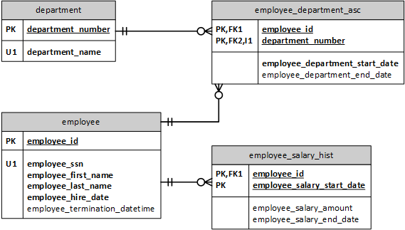

# Create table in PostgreSQL

Goal of this tutorial is to introduce you to basic concepts of create table using simple business scenario. In this tutorial you will learn to :-

* Create simple tables with basic data types.
*	Create basic constraints primary key, foreign key and check constraint.

## Business scenario
A company employees John Smith, Mary Smith, Arnold Jackson and Jeffery Westman they are identified by SSN and employee id.  John works in Sales, Mary works in Research and Arnold and Jeffery work in Accounting. There are other departments that do not have employees at current time also there are employees that are not associated to departments.  All departments have unique department number associated and is autogenerated when a new department is added. The current payroll system captures salary history of all employees and all salaries are greater than 1000 dollars.

Below is the data model picture that depicts the business scenario. Normally people use nouns to identify tables and verbes for relationships when using business scenario like above. 

In this tutorial, you'll use psql to interact with a PostgreSQL database.  You'll use the following credentials to connect to the workshop database:

1. Username: groot
1. Password: password (same password for the postgres user as well)
1. A database named: workshop

 Let's get started
